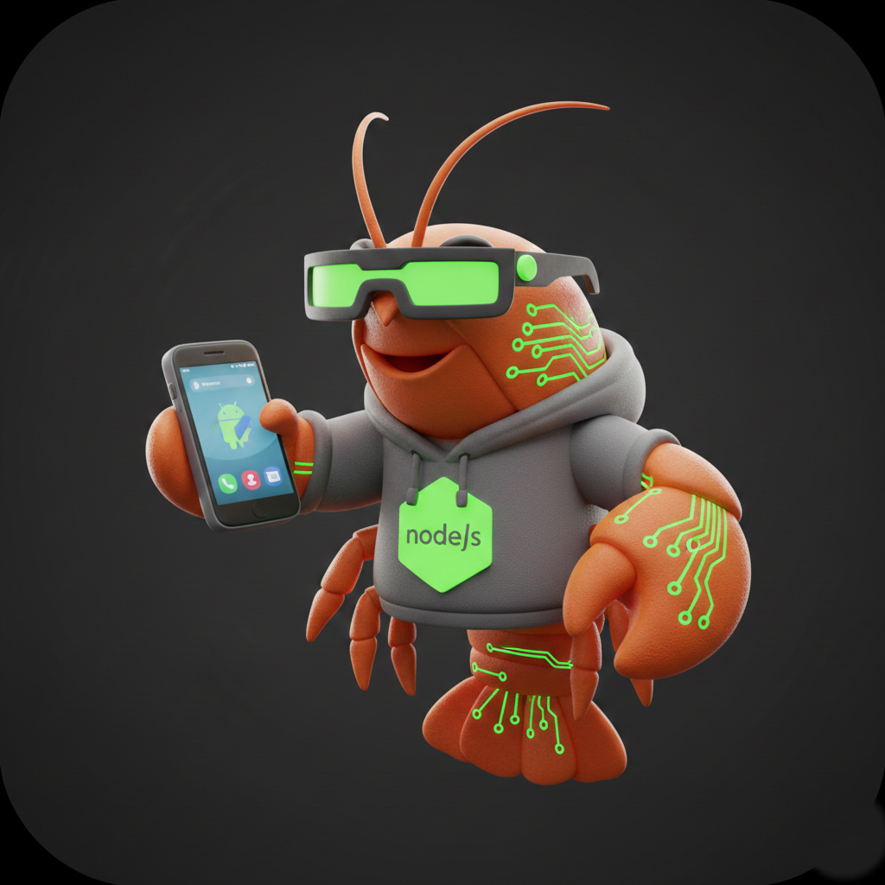

<p align="center">
  
</p>

<h1 align="center">Anode ClawdBot</h1>

<p align="center">
  <strong>基于 ACS 平台的 Android AI Agent 系统，运行在 Javet Node.js 引擎上，支持 Claude / DeepSeek / OpenAI 等多模型。</strong>
</p>

<p align="center">
  <a href="https://acs.yunxi668.cn"></a>
  
  
  
  
</p>

<p align="center">
  <a href="https://acs.yunxi668.cn">官网</a> &middot;
  <a href="#功能特性">功能特性</a> &middot;
  <a href="#快速开始">快速开始</a> &middot;
  <a href="#社交平台适配">社交平台</a>
</p>

---

## 功能特性

- **多模型支持** - Claude (Anthropic)、DeepSeek、OpenAI 兼容 API
- **流式输出** - 实时响应流，支持工具调用
- **社交平台集成** - Telegram、Discord、钉钉、飞书、QQ 适配器
- **工具系统** - 17+ 内置工具，覆盖文件操作、Android 自动化、网络请求、设备控制
- **插件系统** - 可扩展架构，支持第三方插件
- **队列管理** - 串行/并行任务执行
- **记忆系统** - 语义记忆 + 向量搜索
- **主动行为** - AI 心跳建议、异常提醒、任务提示
- **安全机制** - 命令分级、审批系统、安全工具
- **多媒体消息** - 附件从工具层流转至 UI 和社交平台

## 快速开始

### 第一步：安装依赖（电脑端）

```bash
npm install
```

### 第二步：构建项目（电脑端）

```bash
npm run build
```

构建完成后生成 `dist` 目录，包含编译后的 JS 文件和 `assets/prompts`。

### 第三步：复制到设备

将整个项目文件夹复制到 Android 设备上的 ACS 项目路径，例如：

```
/sdcard/ACS/projects/anode-clawdbot/
```

### 第四步：在设备终端进入项目

打开 ACS 终端，cd 到项目路径：

```bash
cd /sdcard/ACS/projects/anode-clawdbot
```

### 第五步：安装运行时依赖（设备端）

```bash
npm install --ignore-scripts --no-bin-links
```

> `--ignore-scripts` 跳过 postinstall 等脚本，避免设备端缺少编译工具导致报错。

### 第六步：运行

在 ACS 编辑器中打开 `dist/start-ui.js`，点击运行按钮即可启动。

## 配置说明

复制默认配置文件并编辑：

```bash
cp assets/config.default.json config.json
```

主要配置项：

| 配置项 | 说明 | 示例 |
|--------|------|------|
| `model.provider` | AI 提供商 | `"anthropic"` / `"deepseek"` / `"openai"` |
| `model.model` | 模型名称 | `"claude-sonnet-4-20250514"` |
| `model.apiKey` | API 密钥，支持 `${ENV_VAR}` 语法 | `"sk-xxx"` |
| `model.baseURL` | 自定义 API 地址（DeepSeek/Kimi 等） | `"https://api.deepseek.com"` |
| `social.telegram.botToken` | Telegram Bot Token | - |
| `social.discord.botToken` | Discord Bot Token | - |

## 项目结构

```
src/
├── core/           # Agent 管理、会话、模型 API、流式处理
├── config/         # 配置管理
├── tools/          # 工具系统与内置工具
├── ui/             # 悬浮窗 UI 组件
├── plugins/        # 插件系统
├── social/         # 社交平台适配器
├── skills/         # 内置技能（摘要等）
└── utils/          # 日志、安全、性能工具
```

## 内置工具

| 分类 | 工具 |
|------|------|
| 文件 | read_file, write_file, list_files, delete_file, file_exists |
| Android | android_click, android_swipe, android_find_text, android_input_text, android_screenshot |
| 图像 | resize_image, crop_image, rotate_image, flip_image, gaussian_blur, edge_detection |
| 网络 | http_request, http_get, http_post, download_file, upload_file |
| 设备 | get_device_info, get_battery_info, show_toast, get_current_app |

## 社交平台适配

- **Telegram** - 完整 Bot API，轮询模式
- **Discord** - discord.js 集成，支持私信和 @提及
- **钉钉** - Stream SDK 企业消息
- **飞书** - Lark/飞书机器人集成
- **QQ** - QQ 官方机器人 API

## 技术栈

- **运行时**: Javet Node.js Engine (Android)
- **语言**: TypeScript (ES2021)
- **AI SDK**: @anthropic-ai/sdk, openai
- **校验**: Zod
- **配置**: JSON5

## 许可证

MIT
